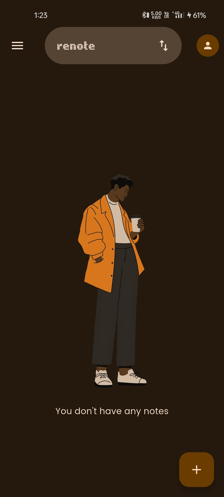
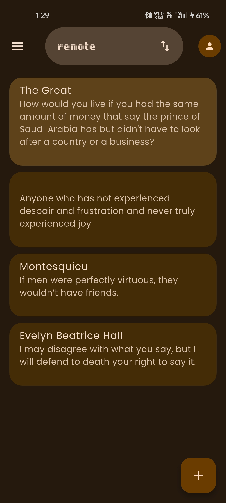
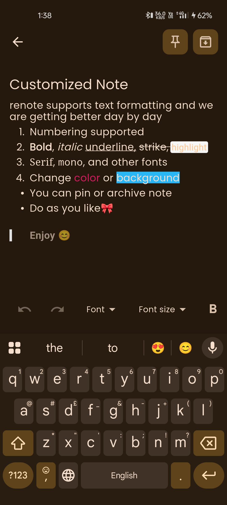
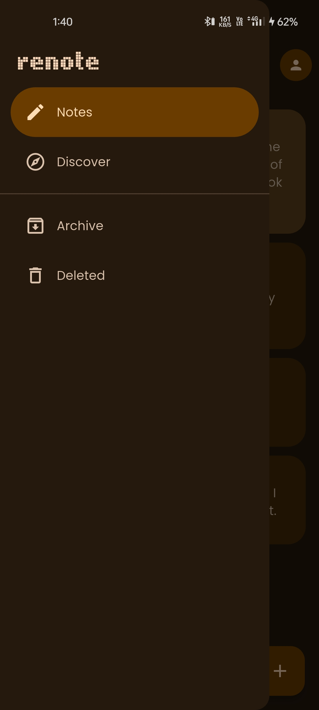
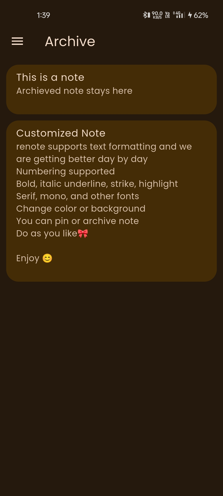

    
    <h1>renote</h1>
    
Take notes on the go.

---

  
  
  

  
  

## Features

- View, Archive and move notes to bin
- Customize your notes
- Discover others' notes (soon)
- Material 3 Adaptive design

## Installation

## Tech Stack

**Client:** Flutter, Android

**Backend:** Hive local database
